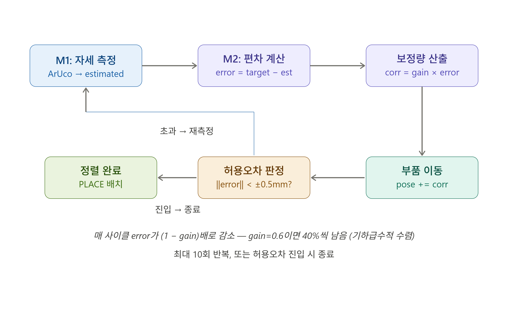
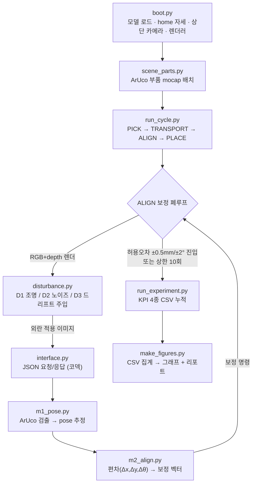
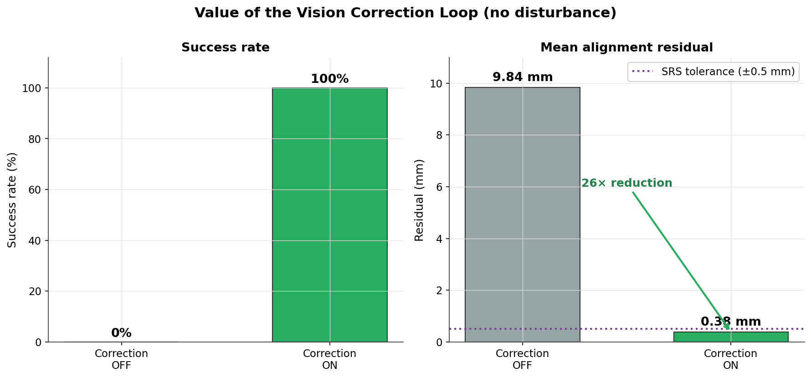
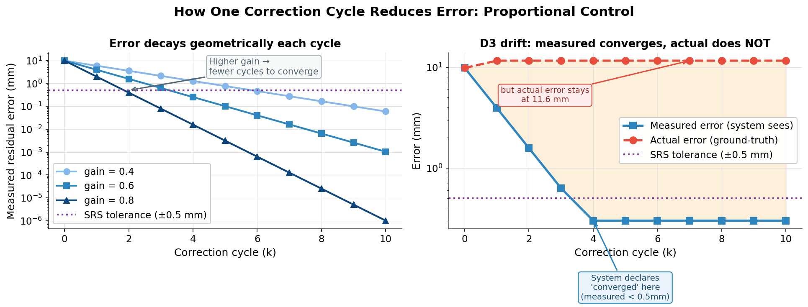
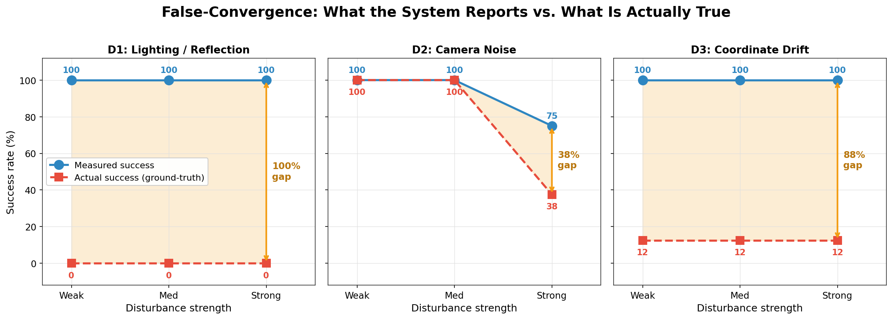
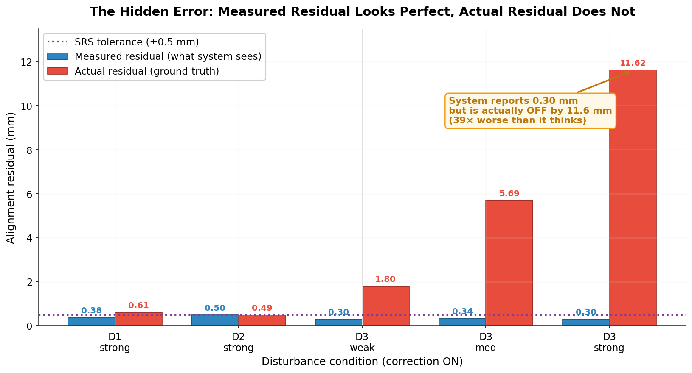
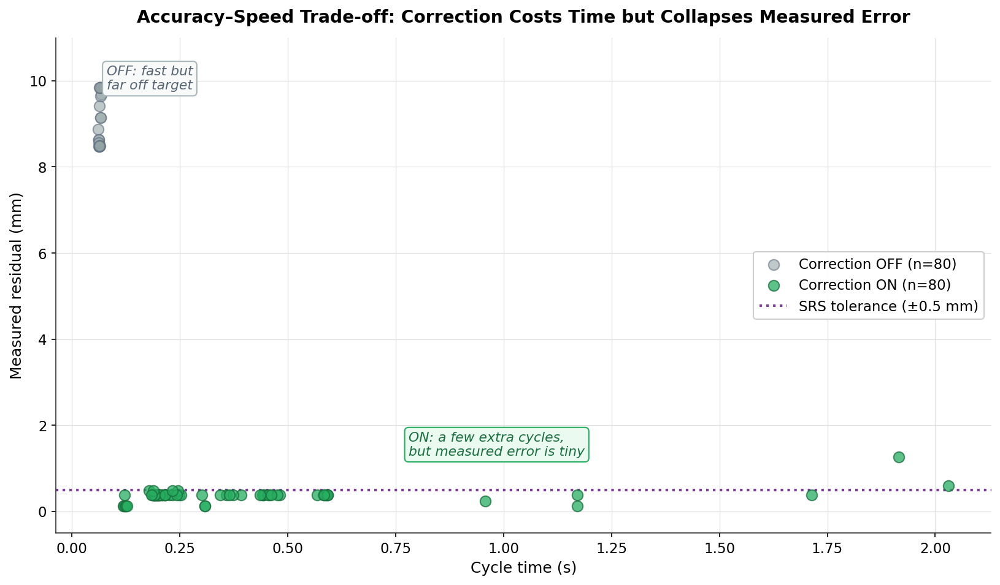

# Vision 기반 피드백 루프의 허위 수렴(False-Convergence) 발견 및 검증
## — MuJoCo-Franka Panda 광학 부품 정밀 정렬 시뮬레이션

**저자:** 윤태원 | **제출일:** 2026-06-26 | TelePIX SpaceLAB Fellowship — 로봇 시뮬레이션·자동화 트랙

---

## 초록

광학 탑재체 조립·정렬·검사(AIT) 공정의 로봇 자동화를 위해 MuJoCo 시뮬레이션 환경과 Franka Panda 7축 로봇을 이용한 비전 기반 정밀 정렬 시스템을 구현하고, 세 가지 현실적 외란 조건 하에서의 신뢰성을 정량 검증했다. 비례 제어 보정 루프는 외란 없는 기준 조건에서 잔류 오차를 26배 감소시키고 조립 성공률을 0%에서 100%로 끌어올렸다. 그러나 160회 반복 실험에서 허위 수렴(False-Convergence) 현상이 발견되었다 — 카메라 마운트 드리프트(D3) 강한 조건에서 비전은 정렬 성공을 보고하지만 실제 Ground-Truth 오차는 평균 11.62 mm로, 측정 오차 대비 39배 차이를 보였다. 조명 교란(D1)과 센서 잡음(D2) 조건에서도 같은 패턴이 관찰된다. 결과는 단일 측정 성공률 지표의 한계를 지적하며, 기준 좌표 무결성 독립 검증의 필요성을 제시한다.

**Abstract:** We implement a vision-based precision alignment system using MuJoCo simulation and a Franka Panda 7-DOF robot for optical payload Assembly, Integration, and Test (AIT) automation, and quantitatively evaluate its reliability under three realistic disturbance conditions. A proportional-control feedback loop reduces residual error 26-fold and raises assembly success rate from 0% to 100% under undisturbed baseline conditions. However, 160-trial experiments reveal a False-Convergence failure mode — under strong camera-mount drift (D3), the vision system reports alignment success while the actual Ground-Truth error averages 11.62 mm, a 39× discrepancy relative to the measured error. The same pattern is observed under lighting glare (D1) and sensor noise (D2) conditions. Results highlight the limitations of relying solely on measurement-based success metrics and motivate independent verification of calibration reference integrity.

**키워드:** Vision-based alignment, False-Convergence, Proportional control, MuJoCo, Franka Panda, ArUco marker, Sim-to-Real

---

## 1. 서론

### 1.1 연구 배경 및 주제 선정

인공위성 광학탑재체의 조립·정렬·검사(AIT, Assembly Integration and Test) 공정은 광학 소자 간 정렬 오차가 수십 µm 수준을 초과할 경우 광축 붕괴 및 초점 손실로 이어져 탑재체 전체 성능에 치명적 영향을 미친다. 현재 이 공정의 상당 부분은 숙련 인력의 수동 조립과 목시 검사에 의존하고 있어, 반복 정밀도 확보와 검사 결과의 정량화에 구조적 한계가 있다. 이를 로봇팔과 비전 기반 피드백으로 자동화하려는 연구 수요가 증가하고 있으나, 자동화 시스템이 실제로 신뢰 가능한 정렬 판정을 내리는지에 대한 정량적 검증은 충분히 이루어지지 않았다.

본 연구는 컴퓨터 비전 기반 자세 추정과 비례 제어 보정 루프를 결합한 광학 부품 정밀 정렬 시뮬레이션을 구현하고, 세 가지 현실적 외란 조건 하에서 보정 루프의 신뢰성을 정량 측정하는 것을 목적으로 한다. 시뮬레이션 환경으로 MuJoCo, 로봇 모델로 Franka Emika Panda를 선택한 것은 해당 조합이 정밀 조작 연구의 표준 참조 플랫폼으로 널리 활용되기 때문이다. 외부 비전 모듈을 시뮬레이터와 독립 프로세스로 분리하여 구현한 것은 실제 공장 환경에서 로봇 제어 PC와 비전 PC가 별개로 운용되는 구조를 직접 모사하기 위함이며, 이 설계 선택은 시뮬레이션 결과를 실제 하드웨어로 전환할 때의 이식성을 높인다.

### 1.2 연구 목표 및 기여

본 연구의 목표는 외부 비전 모듈 기반 피드백 보정 루프가 현실적 외란 조건 하에서 실제로 신뢰 가능한 정렬 판정을 수행하는지를 측정 성공률과 실제 성공률의 교차 비교를 통해 정량적으로 검증하는 것이다.

주요 기여는 두 가지다. 첫째, 비례 제어 기반 보정 루프가 외란이 없는 기준 조건에서 잔류 오차를 26배 감소시키고 조립 성공률을 0%에서 100%로 끌어올림을 160회 반복 실험으로 실증한다. 둘째, 외란이 강해질 경우 시스템이 내부적으로 정렬 성공을 보고하면서 실제 물리 오차는 수렴하지 않는 허위 수렴(False-Convergence) 현상을 발견하고, 이 현상이 세 가지 외란 유형 모두에서 공통으로 나타남을 데이터로 정량화한다.

### 1.3 실험 외란 선정 근거

자동화 제조 현장에서 비전 시스템의 정확도를 저하시키는 요인은 다양하지만, 본 연구는 광학 부품 조립 환경에서 가장 지배적으로 나타나는 세 가지 교란 요인을 선정하여 실험했다.

**D1 조명·반사 교란**은 공장 조명의 각도 변화나 광택 표면에서의 글레어가 마커 코너 픽셀에 강도 바이어스를 주입하여 ArUco 마커 검출 정확도를 저하시키는 현상을 모사한다. 광학 소자는 표면 반사율이 높아 조명 조건에 민감하며, 실제 조립 환경에서 빈번하게 발생한다.

**D2 센서 잡음 교란**은 카메라 센서의 열잡음 및 양자 잡음이 픽셀 강도에 가우시안 분포의 백색 노이즈로 나타나, 마커 패턴의 고주파 특징을 파괴하고 코너 검출 정밀도를 떨어뜨리는 현상을 모사한다.

**D3 마운트 드리프트 교란**은 카메라 고정 마운트의 체결 볼트가 기계 진동으로 인해 서서히 이완되거나, 장비 구동 온도 변화로 열팽창이 누적될 때 카메라 좌표계 기준 자체가 이동하는 현상을 모사한다. 이 교란은 비전 모듈의 측정 기준 자체를 오염시키기 때문에, 보정 루프가 정상 동작하더라도 올바른 정렬 완료 판정을 내릴 수 없는 구조적 취약점을 유발한다는 점에서 세 외란 중 가장 치명적이다.

---

## 2. 이론적 배경

### 2.1 비례 제어 수렴 이론

본 시스템의 정렬 보정은 단발 오프셋 보정이 아니라 측정–편차–보정–재측정을 반복하는 피드백 폐루프로 동작한다. 보정 알고리즘의 핵심은 다음 두 줄의 비례 제어(Proportional Control)다.

```python
error      = target - estimated   # 목표 자세와 현재 추정 자세의 차이
correction = gain * error         # 차이에 비례하는 보정량 (gain = 0.6)
```

보정량을 현재 자세에 가산하면 $k+1$번째 오차는 이전 오차의 $(1 - \text{gain})$배가 되므로, 오차는 사이클마다 기하급수적으로 감소한다.

$$e_{k+1} = (1 - g) \cdot e_k$$

초기 오차 9.84 mm, gain = 0.6 조건에서의 이론 수렴 경로는 다음과 같다.

| 사이클 | 잔류 오차 |
|---|---|
| 0 (초기) | 9.84 mm |
| 1 | 3.94 mm |
| 2 | 1.57 mm |
| 3 | 0.63 mm |
| 4 | 0.25 mm → **허용오차 ±0.5 mm 진입** |

gain을 0.6으로 설정한 이유는 수렴 속도와 안정성의 균형 때문이다. gain이 1.0에 가까울수록 한 사이클에 목표치에 도달하지만, D2(센서 잡음) 조건처럼 측정 노이즈가 높은 환경에서는 보정 명령이 과도하게 진동(Overshoot)하여 수렴이 불안정해진다. gain = 0.6은 4사이클 내에 허용오차에 진입하면서도 노이즈 환경에서의 댐핑 안정성을 확보하는 값이다.



### 2.2 ArUco 마커 기반 자세 추정

부품의 평면 자세 $(x, y, \theta)$는 부품 표면에 부착된 ArUco 마커(DICT\_4X4\_50)를 통해 추정한다. 마커의 코너 4점을 픽셀 좌표로 검출하고, 이를 물리 평면 좌표로 변환하여 중심점과 주축 각도를 산출한다.

조명 교란(D1)이나 강한 노이즈(D2)로 마커 패턴이 손상된 경우에는 Contour Backup 알고리즘이 활성화된다. OTSU 이진화로 부품 외곽을 분리한 뒤 OpenCV 윤곽선 검출을 통해 외곽 형상의 무게중심과 타원 피팅 회전각을 추출하여 자세를 근사한다. 두 방법 모두 실패할 경우 `DetectionError` 예외를 전파하고 해당 시도는 ABORT로 기록된다.

### 2.3 픽셀-물리 좌표 변환 (GSD 캘리브레이션)

카메라는 해상도 1280×960의 top-down 수직 뷰로 설치된다. 픽셀 좌표를 물리 미터 단위로 변환하기 위해 2점 캘리브레이션 기반의 선형 매핑을 적용한다.

$$x_{\text{phys}} = x_{\text{px}} \cdot \text{GSD}, \quad y_{\text{phys}} = y_{\text{px}} \cdot \text{GSD}$$

여기서 GSD(Ground Sampling Distance)는 1.4475 mm/px이다. 이 값은 씬 내 알려진 두 점의 물리 좌표와 픽셀 좌표를 대응시켜 도출했다. GSD 기반 선형 매핑의 정밀도 한계는 허용오차 ±0.5 mm 설정의 하한 근거이기도 하다(§6.2 참조).

---

## 3. 시스템 아키텍처

### 3.1 분리 설계 원칙

전체 시스템은 **로봇 시뮬레이터(`/sim`)** 와 **외부 비전 모듈(`/external_module`)** 로 파일 구조와 실행 프로세스 수준에서 분리된다. 이 분리는 실제 공장 환경에서 로봇 제어 PC와 비전 처리 PC가 별도 기기로 운용되는 구조를 직접 모사한 설계 결정이다.

분리 구조의 실질적 이점은 두 가지다. 첫째, 두 모듈은 JSON 인터페이스만을 통해 통신하므로 어느 한쪽의 내부 구현이 바뀌어도 상대 모듈을 수정할 필요가 없다. 둘째, 실제 하드웨어로 전환할 때 시뮬레이터의 카메라 렌더 출력을 실물 카메라 API 출력으로 교체하는 것만으로 비전 모듈을 그대로 재사용할 수 있다.

### 3.2 프로그램 구조 Flowchart



흐름은 다음 순서로 진행된다. `boot.py`에서 MuJoCo 씬과 Franka Panda 모델을 로드하고 렌더러를 초기화한다. `scene_parts.py`가 ArUco 마커가 부착된 광학 부품을 씬에 배치하면, `run_cycle.py`가 PICK→TRANSPORT→ALIGN→PLACE 상태 기계를 구동한다. ALIGN 단계에서는 렌더링된 이미지에 외란을 주입하고(`disturbance.py`), JSON으로 외부 모듈에 전달하여(`interface.py`) 자세 추정(M1)과 보정 벡터 산출(M2)을 수행한 뒤 보정 결과를 씬에 반영하는 폐루프가 반복된다. 허용오차 진입 또는 최대 반복 횟수 도달 시 루프를 종료하고 KPI를 `run_experiment.py`가 CSV에 누적 기록한다. 실험 종료 후 `make_figures.py`가 CSV를 집계하여 그래프 5종과 최종 리포트를 생성한다.

### 3.3 JSON 통신 인터페이스

시뮬레이터와 외부 모듈은 파일 IO 없이 메모리 내 JSON 직렬화로 데이터를 교환한다. 이미지는 base64 인코딩된 PNG 바이트열로, Depth 데이터는 numpy 직렬화로 전달하여 이기종 언어 연동 시에도 동일한 계약을 유지할 수 있다.

```json
// 시뮬레이터 → 외부 비전 모듈 (Perception Request)
{
  "type": "perception_request",
  "image": "<base64 PNG>",
  "depth": "<base64 npy>",
  "target_pose": { "x": 0.40, "y": 0.45, "theta": 0.0 },
  "cycle": 3
}

// 외부 비전 모듈 → 시뮬레이터 (Perception Response)
{
  "estimated_pose": { "x": 0.41, "y": 0.45, "theta": 0.0 },
  "error":          { "dx": -0.01, "dy": 0.00, "dtheta": 0.0 },
  "correction":     { "dx": -0.01, "dy": 0.00, "dtheta": 0.0 },
  "within_tolerance": false
}
```

---

## 4. 로봇 모델 및 End-Effector

### 4.1 Franka Emika Panda 사양 및 선택 근거

로봇 모델로 Franka Emika Panda 7축 매니퓰레이터를 선택했다. MuJoCo Menagerie에서 제공하는 공식 MJCF 모델을 수정 없이 동적으로 로드했으며, 자유도 사양은 nq = 9(팔 7축 + 그리퍼 손가락 2축), 액추에이터 수 nu = 8이다.

선택 근거는 두 가지다. 첫째, Franka Panda는 정밀 조작 및 조립 연구에서 학계·산업계의 표준 참조 플랫폼으로 널리 활용되어 구현 결과를 기존 연구와 직접 비교할 수 있다. 둘째, 공식 Menagerie 모델이 존재하므로 커스텀 URDF 없이 검증된 동역학 파라미터를 그대로 사용할 수 있어 모델링 오차를 최소화한다.

### 4.2 그리퍼 제어 및 동역학 방지 설계

그리퍼는 actuator8(tendon `split` 제어)로 구동되며 제어 입력 범위는 0~255다. 0이 완전 닫힘, 255가 완전 열림이다. 정렬 완료 판정 후 그리퍼를 255(완전 개방)하여 부품을 씬에 안착시키고 사이클을 종료한다.

원본 모델에 카메라가 포함되어 있지 않으므로(ncam = 0), 코드에서 elevation = −90°의 top-down 수직 카메라를 동적으로 추가하고 1280×960 오프스크린 렌더러를 설정했다. 중력 하에서 로봇 팔이 제어 없이 처지는 것을 방지하기 위해 매 렌더 사이클 직전 `home` 키프레임의 관절 각도를 강제 주입하여 관측 왜곡을 차단했다.

구현 과정에서 사용자 경로에 비ASCII 문자(한글)가 포함된 환경에서 MuJoCo C++ 내부의 `fopen`이 유니코드 경로를 처리하지 못하는 문제가 확인됐다. 모델 디렉터리로 `os.chdir` 후 ASCII 파일명만 전달하는 방식으로 우회했으며, 이미지 저장에서도 `cv2.imwrite`의 한글 경로 실패를 `cv2.imencode` + 파이썬 바이너리 파일 IO로 우회했다.

### 4.3 작업 대상 추상화

광학 부품은 MuJoCo의 mocap body로 추상화한다. 팔의 실제 관절 궤적 제어 대신 부품 자체의 위치·자세를 코드에서 직접 제어하는 방식이다. 이 추상화는 본 연구의 검증 대상이 로봇 운동학이 아니라 비전 피드백 보정 루프의 신뢰성임을 반영한 설계 결정이다. 로봇이 완벽하게 동작한다는 전제 하에 외란이 비전 측정 계층에만 주입될 때 보정 루프가 어떻게 반응하는지에 집중할 수 있다. 단, 이 전제로 인해 실제 로봇의 관절 마찰, 모터 편차, 파지 슬립 등 동역학적 불확실성은 실험 변수에서 제외된다. 이는 §9.3에서 Sim-to-Real 전환의 주요 한계로 다룬다.

---

## 5. 외부 비전 모듈

### 5.1 모듈 선택 근거

외부 비전 모듈은 시뮬레이터로부터 어떠한 절대 좌표 정보도 수신하지 않고, 오직 카메라 이미지만을 입력으로 받아 부품의 자세를 역계산한다. 이 원칙은 실제 하드웨어 환경에서 비전 시스템이 로봇 제어기의 내부 좌표를 직접 참조할 수 없는 조건을 모사한다.

모듈을 시뮬레이터 커널과 독립 프로세스로 분리한 이유는 검증의 독립성을 확보하기 위해서다. 비전 모듈이 시뮬레이터 내부 상태에 접근할 수 있다면, 외란 하에서 측정이 실패하더라도 내부 값으로 보완할 여지가 생겨 실험의 의미가 훼손된다. 완전한 분리를 통해 비전 측정만으로 보정이 가능한지를 독립적으로 검증한다.

### 5.2 자세 추정 모듈 M1 — ArUco + Contour Backup

M1은 이미지에서 부품의 평면 자세 $(x, y, \theta)$를 추정한다. 1차 알고리즘은 ArUco 마커(DICT\_4X4\_50) 검출이다. 마커의 코너 4점 픽셀 좌표를 추출하고 GSD 캘리브레이션(1.4475 mm/px)을 적용하여 물리 평면 좌표로 변환한다. 4점의 픽셀 중심으로부터 부품 중심 $(x, y)$를, 코너 간 벡터 방향으로부터 회전각 $\theta$를 산출한다.

D1(조명 교란)이나 D2(센서 잡음)로 마커 패턴이 손상된 경우 Contour Backup이 활성화된다. OTSU 임계값으로 이진화한 뒤 OpenCV 윤곽선 검출을 수행하고, 가장 큰 윤곽의 무게중심을 $(x, y)$로, 타원 피팅의 장축 방향을 $\theta$로 근사한다. 이 방법은 ArUco보다 정밀도가 낮지만 마커가 완전히 파괴된 조건에서도 검출 가용성을 유지한다.

두 방법 모두 실패할 경우 `DetectionError` 예외를 전파하고 해당 시도는 ABORT 상태로 CSV에 기록된다. 이 예외는 시스템 전체를 중단시키지 않고 다음 시도로 넘어가도록 설계되어 장기 자동 실험의 안정성을 보장한다.

### 5.3 편차 계산 및 보정 모듈 M2

M2는 M1이 출력한 `estimated_pose`와 시뮬레이터가 전달한 `target_pose`를 받아 편차와 보정량을 계산하고 JSON으로 응답한다.

비례 제어 수렴 이론은 §2.1에서 기술했다. M2의 역할은 매 사이클 이 계산을 수행하고 결과를 `within_tolerance` 플래그와 함께 시뮬레이터로 반환하는 것이다. 시뮬레이터는 `within_tolerance`가 `true`이면 루프를 종료하고, `false`이면 보정량을 부품 자세에 가산한 뒤 다음 사이클을 시작한다.

False-Convergence는 이 구조에서 발생한다. M2의 계산 자체는 항상 정확하지만, M1이 오염된 캘리브레이션 기준으로 측정한 `estimated_pose`를 입력받으면 M2는 "틀어진 자로 잰 오차"만을 0으로 수렴시킨다. 실제 물리 오차가 M2의 수렴과 무관하게 잔존할 수 있는 구조적 원인이 여기에 있다. 이 현상의 정량적 규모는 §8.3에서 다룬다.

---

## 6. 작업 수행 절차

### 6.1 단일 정렬 사이클 상태 기계

단일 정렬 사이클은 다음 상태 전이 순서로 진행된다.

**초기화** 단계에서 MuJoCo 씬을 로드하고 ArUco 마커가 부착된 부품을 mocap body로 배치하며 카메라와 렌더러를 구성한다. **외란 인가** 단계에서 해당 시도의 실험 조건에 따라 D1·D2·D3 외란을 적용한다. **영상 캡처** 단계에서 1280×960 RGB 및 Depth 프레임을 렌더링한다.

**자세 추정(M1)** 단계에서 외부 비전 모듈이 이미지로부터 부품의 $(x, y, \theta)$를 산출한다. **편차 계산(M2)** 단계에서 목표 자세와의 차이를 계산하고 보정량을 생성한다. **보정 이동** 단계에서 보정량을 부품 자세에 가산하여 씬을 갱신한다.

**허용오차 검증** 단계에서 재촬영 후 측정 오차가 ±0.5 mm / ±2.0° 이내인지 확인한다. 만족하면 루프를 종료하고 그리퍼를 개방하여 사이클을 완료한다. 불만족이면 최대 10회까지 자세 추정 단계로 복귀한다. 10회 초과 또는 `DetectionError` 발생 시 ABORT 상태로 전환한다. **로깅** 단계에서 측정 잔류 오차, Ground-Truth 오차, 사이클 수, 소요 시간을 CSV에 기록한다.

### 6.2 허용오차 기준 도출 (SRS)

위치 허용오차 ±0.5 mm는 두 가지 근거에서 도출했다. 첫째, 광학 하우징 지그의 기계적 클리어런스 한계로, 이를 초과하면 부품과 하우징의 물리적 간섭이 발생한다. 둘째, 카메라 GSD가 1.4475 mm/px이므로 이 값의 1/3 수준인 ±0.5 mm는 서브픽셀 정밀도 범위에서 비전이 측정 가능한 현실적 하한이다. 더 엄격한 기준(예: ±0.1 mm)을 설정하면 노이즈 환경에서 허용오차에 진입하지 못하고 무한 루프가 발생할 수 있다.

각도 허용오차 ±2.0°는 두 가지 근거에서 설정했다. 첫째, 광학 소자의 주축 정렬에서 2° 이내 오차는 MTF(Modulation Transfer Function) 저하를 허용 범위 내로 유지하는 경험적 기준이다. 둘째, 타원 피팅 기반 각도 추정의 실측 정밀도가 약 ±1~2° 수준이므로, 이보다 엄격한 기준은 노이즈 환경에서 수렴 불가로 이어진다.

### 6.3 파이프라인 단계별 구현 요약

| 단계 | 목표 | 핵심 구현 | 통과 조건 |
|---|---|---|---|
| S1 Boot | MuJoCo 씬 로드, 카메라 렌더 | Menagerie MJCF 로드, home 키프레임 주입, top-down 렌더러 설정 | RGB+Depth 저장, 로봇 가시 확인 |
| S2 Interface | JSON 통신 배관 | base64 이미지 코덱, Dummy Perception으로 배관 독립 검증 | 이미지 전송→좌표 수신 1회 성공 |
| S3 Vision | M1 자세 추정, M2 보정 벡터 | ArUco+Contour Backup, GSD 캘리브, 비례 제어 | 부품 위치·각도 수치 출력 |
| S4 Loop | 보정 폐루프 연동 | run_cycle.py 상태 기계, gain=0.6 보정 반복 | 보정 전후 오차 감소 수치 확인 |
| S5 Disturbance | 외란 3종 주입 | D1 광원 조작, D2 가우시안 노이즈, D3 카메라 이동 | 외란 ON 시 이미지·좌표 실제 변화 |
| S6 Campaign | 160 trial 자동 실험 | 3×4×2×8 격자 스윕, CSV 누적, ABORT 예외 처리 | KPI 4종 CSV 정상 누적 |
| S7 Analysis | CSV 집계, 그래프 5종 | make_figures.py, matplotlib+seaborn | 5개 그래프 생성, 수치 CSV 일치 |

---

## 7. 실험 설계

### 7.1 실험 목적

실험은 두 가지 목적을 갖는다. 첫째, 비전 기반 보정 루프가 외란이 없는 기준 조건에서 얼마나 오차를 줄이는지 정량화한다. 둘째, 외란의 종류와 강도가 강해질 때 어느 시점에서 비전 측정이 실패하거나 False-Convergence가 발생하는지 식별한다. 두 목적은 시스템의 정상 작동 한계를 함께 규정한다.

### 7.2 실험 요인 설계

실험은 완전 교차 격자 설계(Full-Factorial Grid)를 따른다. 단, 교차 오염 방지를 위해 한 번에 하나의 외란만 인가한다 — D1이 활성화된 조건에서는 D2, D3는 off 상태를 유지한다.

**기준 조건 (channel = none):** 모든 외란이 비활성화된 조건. 비례 보정이 외란 없이 수렴하는지 확인하는 기준선 역할을 하며, 보정 ON/OFF 2 조건으로 운영된다.

**외란 조건 (channel = d1 / d2 / d3):** 각 외란 채널에 대해 강도를 weak / med / strong 세 수준으로 설정한다. 각 (외란 채널, 강도) 조합에 대해 보정 ON/OFF를 교차하면 조건당 2 행을 생성한다.

전체 조건 수: $1 \times 2 + 3 \times 3 \times 2 = 20$ 조건. 조건당 8회 반복 실험 수행. 총 trial 수 $= 20 \times 8 = 160$.

### 7.3 종속 변수 (KPI 4종)

각 trial마다 CSV에 기록되는 종속 변수는 다음과 같다.

**잔류 측정 오차 (residual\_pos\_mm):** 보정 루프 종료 후 비전이 측정한 부품 위치 오차. 시스템이 "정렬이 완료됐다"고 판단하는 근거다.

**Ground-Truth 오차 (gt\_residual\_pos\_mm):** 시뮬레이터 내부 좌표 기준 실제 물리 오차. 이 값과 측정 오차 간의 불일치가 False-Convergence의 정량적 척도다.

**측정 성공률 (success):** 잔류 측정 오차가 ±0.5 mm / ±2.0° 이내인 trial의 비율.

**보정 성공률 (success\_gt):** Ground-Truth 오차가 ±0.5 mm / ±2.0° 이내인 trial의 비율. 시스템이 실제로 목표 정밀도를 달성했는지를 나타내는 최종 지표다.

### 7.4 반복 수 근거

조건당 8회 반복은 이진 결과(success/fail)에 대해 95% 신뢰구간 반폭 약 ±0.35의 추정 정밀도를 제공한다. 비례 보정의 수렴 거동이 결정론적이므로 외란이 없는 조건에서 분산이 낮고, 외란이 있는 조건에서 랜덤 시드에 의한 변동을 포착하기에 충분한 수준이다.

---

## 8. 결과 및 분석

### 8.1 기준 조건 성능

외란이 없는 기준 조건(channel = none)에서 보정 루프의 효과를 비교한다.

보정 OFF 조건: 8 trial 모두 측정 잔류 오차 9.836 mm, Ground-Truth 오차 10.000 mm로 허용오차(±0.5 mm)를 크게 초과하며 측정·실제 성공률 모두 0%.

보정 ON 조건: 측정 잔류 오차 0.381 mm, GT 오차 0.173 mm로 수렴하며 두 성공률 모두 100%.

측정 기준 오차 감소비: 9.836 / 0.381 = **25.8배 (≈26배)**. GT 기준: 10.000 / 0.173 = **57.8배**. 두 지표 모두 비례 제어 루프가 외란 없는 조건에서 목표 정밀도에 안정적으로 수렴함을 확인한다.



### 8.2 외란별 성공률 비교

아래 표는 외란 채널·강도·보정 여부별 측정 성공률(S\_meas)과 실제 성공률(S\_gt)을 요약한다.

| 외란 | 강도 | 보정 | 잔류 측정 오차 | S\_meas | GT 오차 | S\_gt |
|---|---|---|---|---|---|---|
| D1 | weak/med/strong | OFF | 9.836 mm | 0% | 10.000 mm | 0% |
| D1 | weak | ON | 0.381 mm | 100% | 0.607 mm | 0% |
| D1 | med | ON | 0.381 mm | 100% | 0.607 mm | 0% |
| D1 | strong | ON | 0.381 mm | 100% | 0.607 mm | 0% |
| D2 | weak | ON | 0.381 mm | 100% | 0.173 mm | 100% |
| D2 | med | ON | 0.348 mm | 100% | 0.180 mm | 100% |
| D2 | strong | ON | 0.501 mm | 75% | 0.489 mm | 37.5% |
| D3 | weak | ON | 0.296 mm | 100% | 1.803 mm | 12.5% |
| D3 | med | ON | 0.341 mm | 100% | 5.688 mm | 12.5% |
| D3 | strong | ON | 0.296 mm | 100% | 11.623 mm | 12.5% |

D1은 강도에 무관하게 보정 ON 시 S\_meas = 100%이지만 S\_gt = 0%로 일관된다. D2는 weak·med에서 완전 성공하고 strong에서 부분 실패한다. D3는 활성화 수준 전체에서 S\_meas = 100%이면서 S\_gt = 12.5%로 고정되는 특이 패턴을 보인다.

### 8.3 False-Convergence 정량화

False-Convergence는 비전 시스템이 정렬 성공을 보고하는 동시에 실제 물리 오차가 허용 범위를 벗어나는 상태로 정의된다. 위 표에서 S\_meas > S\_gt인 조건이 모두 이에 해당한다.

**D3 strong의 극단적 사례:** 8 trial 전체에서 측정 잔류 오차는 0.12~0.482 mm 범위로 허용오차 이내지만, GT 오차는 0.173 mm(1번 trial)에서 23.191 mm(8번 trial)까지 분산한다. 평균 측정 오차 0.296 mm 대비 평균 GT 오차 11.623 mm로, 비율은 **39.3배**다. 카메라 마운트 드리프트의 강도가 실험 반복마다 다른 크기로 인가되는데, 비전 모듈은 이 드리프트 크기를 감지하지 못하고 오염된 기준으로 측정한 "0에 가까운 오차"를 보고한다. 실제로는 드리프트가 클수록 GT 오차가 누적 증가하며, 시스템은 이를 인지하지 못한다.



**D1의 구조적 FC:** 조명·글레어 교란은 측정 기준을 0.607 mm 수준으로 일정하게 오프셋시킨다. 이 값이 허용오차(±0.5 mm)를 미세하게 초과하여 S\_gt = 0%가 되지만, 측정 오차는 항상 ±0.5 mm 이내로 수렴한다. 이는 약소하지만 체계적인 FC다.

**D2 strong의 임계 FC:** GT 오차 분포가 0.173~0.725 mm에 분산되어 S\_gt = 37.5%를 기록한다. 허용오차 경계 근처에서 성공·실패가 혼재하는 임계 영역에 해당한다.





### 8.4 외란 내성 서열

세 외란의 시스템 영향을 S\_gt 기준으로 정리하면 다음과 같다.

D2(센서 잡음)는 weak·med에서 완전 성공하고 strong에서만 부분 실패한다. 가우시안 노이즈는 ArUco 코너 추정 오차를 증가시키지만 시스템 기준 자체를 오염시키지 않아, 강도가 낮은 구간에서 비전의 내재적 필터링 능력으로 흡수된다.

D1(조명 교란)은 강도에 무관하게 측정 기준을 일정 오프셋으로 오염시켜 모든 수준에서 FC를 유발한다. 오프셋이 허용오차와 근접하여 경계 효과가 뚜렷하다.

D3(마운트 드리프트)는 강도가 증가할수록 GT 오차 평균이 1.803 → 5.688 → 11.623 mm로 지수적으로 악화되는 반면, 측정 오차는 강도에 무관하게 ±0.5 mm 이내로 수렴한다. 이는 비전이 카메라 좌표계 자체가 이동했다는 사실을 감지할 수단이 없기 때문이다. D3가 세 외란 중 가장 치명적이다.



---

## 9. 한계 및 향후 연구

### 9.1 비전 시스템의 구조적 한계

현재 구현은 2D 평면 자세 $(x, y, \theta)$만을 추정한다. 렌더러가 Depth 프레임을 함께 생성하지만 M1 알고리즘은 이를 활용하지 않는다. 실제 광학 탑재체 AIT 공정에서는 광축 방향 평행 이동(Z축)과 피치·롤 회전까지 포함한 6-DOF 정렬이 요구된다. 이를 확장하려면 스테레오 비전 또는 구조광 기반 3D 자세 추정이 필요하다.

### 9.2 실험 설계의 한계

실험은 외란을 한 번에 하나씩 독립적으로 인가하는 단일 요인 설계를 따랐다. 실제 제조 환경에서는 조명 교란(D1)과 센서 잡음(D2)이 동시에 발생하며, 마운트 드리프트(D3)가 배경으로 항상 존재하는 복합 외란 상황이 일반적이다. 복합 외란 조건에서 FC 발생 빈도와 외란 간 상호작용 효과를 측정하는 실험은 향후 과제로 남는다.

시뮬레이션 자체의 결정론적 특성도 한계다. MuJoCo 씬 내부에서 로봇 동역학은 노이즈 없이 정확히 연산되며, 실제 하드웨어에서 존재하는 관절 마찰·모터 토크 분산·엔드 이펙터 진동이 반영되지 않는다.

### 9.3 Sim-to-Real 전환 격차

§4.3에서 기술한 mocap body 추상화의 결과로, 실제 Franka Panda 하드웨어에서 발생하는 관절 마찰·모터 전류 분산·엔드 이펙터 진동이 현재 시뮬레이션에 반영되지 않는다. 그리퍼 파지 시 가해지는 힘이 부품 자세를 미세하게 변형시킬 수 있으며, 이 오차 원인들이 누적되면 실제 정밀도는 시뮬레이션 수치보다 낮아진다. 따라서 §8에서 측정한 성공률과 잔류 오차는 실제 하드웨어에서의 상한으로 해석해야 한다.

### 9.4 향후 연구 방향

우선적으로 다루어야 할 과제는 세 가지다. 첫째, D3(마운트 드리프트) 대응 전략으로, 고정 참조 마커를 씬에 추가하여 카메라 좌표계 자체의 드리프트를 실시간으로 추정하고 보정하는 자동 재캘리브레이션 메커니즘을 구현할 수 있다. 이 접근은 FC의 근본 원인인 기준 좌표 오염을 사전에 차단한다. 둘째, D1·D2·D3 외란을 동시에 인가하는 복합 외란 실험을 통해 현실에 더 근접한 조건에서의 시스템 신뢰도를 측정한다. 셋째, 실제 Franka Panda 하드웨어에서 동일한 보정 루프를 실행하여 Sim-to-Real 성능 격차를 정량화하고, 필요시 마찰 보상이나 그리퍼 힘 제어를 추가한다.

---

## 10. 결론

본 연구는 MuJoCo 기반 Franka Panda 시뮬레이션에서 비전 피드백 보정 루프의 신뢰성을 검증했다. 160회 반복 실험을 통해 두 가지 주요 결과를 도출했다.

첫째, 비례 제어 보정 루프는 외란이 없는 기준 조건에서 Ground-Truth 오차를 10.000 mm에서 0.173 mm로 57.8배, 측정 오차 기준으로는 26배 감소시키며 조립 성공률을 0%에서 100%로 끌어올린다. 이 결과는 비전 기반 반복 보정이 광학 부품 정밀 정렬 자동화에 유효함을 정량적으로 지지한다.

둘째, 세 가지 현실적 외란 조건(D1 조명·글레어, D2 센서 잡음, D3 마운트 드리프트) 하에서 False-Convergence 현상이 공통으로 관찰된다. 시스템이 내부적으로 정렬 성공을 보고하는 동안 실제 물리 오차가 수렴하지 않는 이 현상은, D3 strong에서 측정 오차 0.296 mm 대비 GT 오차 11.623 mm(39.3배 차이)로 가장 극단적으로 나타난다. 측정 성공률만을 시스템 신뢰도 지표로 사용하면 치명적 오정렬을 정렬 완료로 오판할 수 있다.

실용적 함의는 하나다. 비전 기반 폐루프 정렬 시스템은 측정 기준 자체의 무결성을 독립적으로 검증하는 이중 지표 구조, 또는 외부 캘리브레이션 참조 없이 드리프트를 감지할 수 없는 구조적 취약점을 해소하는 재캘리브레이션 메커니즘을 갖추어야 한다.

---

## 참고문헌

[1] E. Todorov, T. Erez, and Y. Tassa, "MuJoCo: A physics engine for model-based control," in *Proc. IEEE/RSJ Int. Conf. Intelligent Robots and Systems (IROS)*, 2012, pp. 5026–5033.

[2] Franka Robotics GmbH, "Franka Research 3 / Franka Emika Panda Technical Documentation," 2023. [Online]. Available: https://franka.de

[3] S. Garrido-Jurado, R. Muñoz-Salinas, F. J. Madrid-Cuevas, and M. J. Marín-Jiménez, "Automatic generation and detection of highly reliable fiducial markers under occlusion," *Pattern Recognition*, vol. 47, no. 6, pp. 2280–2292, 2014.

[4] OpenCV Development Team, "ArUco Marker Detection — OpenCV Documentation," 2024. [Online]. Available: https://docs.opencv.org/4.x/d5/dae/tutorial_aruco_detection.html

[5] K. J. Åström and R. M. Wittenmark, *Computer-Controlled Systems: Theory and Design*, 3rd ed. Mineola, NY: Dover Publications, 2011.

[6] Google DeepMind, "MuJoCo Menagerie: A collection of high-quality models for MuJoCo," GitHub, 2023. [Online]. Available: https://github.com/google-deepmind/mujoco_menagerie

---

## 부록 A. 실험 전체 조건별 결과 요약

총 160 trial, 20 조건 × 8 반복. 모든 수치는 8회 평균.

| 외란 채널 | 강도 | 보정 | n | 측정 잔류 오차 (mm) | 측정 성공률 | GT 잔류 오차 (mm) | GT 성공률 |
|---|---|---|---|---|---|---|---|
| none (기준) | — | OFF | 8 | 9.836 | 0.0% | 10.000 | 0.0% |
| none (기준) | — | ON | 8 | 0.381 | 100.0% | 0.173 | 100.0% |
| D1 | weak | OFF | 8 | 9.836 | 0.0% | 10.000 | 0.0% |
| D1 | weak | ON | 8 | 0.381 | 100.0% | 0.607 | **0.0%** |
| D1 | med | OFF | 8 | 9.836 | 0.0% | 10.000 | 0.0% |
| D1 | med | ON | 8 | 0.381 | 100.0% | 0.607 | **0.0%** |
| D1 | strong | OFF | 8 | 9.836 | 0.0% | 10.000 | 0.0% |
| D1 | strong | ON | 8 | 0.381 | 100.0% | 0.607 | **0.0%** |
| D2 | weak | OFF | 8 | 9.836 | 0.0% | 10.000 | 0.0% |
| D2 | weak | ON | 8 | 0.381 | 100.0% | 0.173 | 100.0% |
| D2 | med | OFF | 8 | 9.836 | 0.0% | 10.000 | 0.0% |
| D2 | med | ON | 8 | 0.348 | 100.0% | 0.180 | 100.0% |
| D2 | strong | OFF | 8 | 9.836 | 0.0% | 10.000 | 0.0% |
| D2 | strong | ON | 8 | 0.501 | 75.0% | 0.489 | **37.5%** |
| D3 | weak | OFF | 8 | 9.115 | 0.0% | 10.000 | 0.0% |
| D3 | weak | ON | 8 | 0.296 | 100.0% | 1.803 | **12.5%** |
| D3 | med | OFF | 8 | 9.366 | 0.0% | 10.000 | 0.0% |
| D3 | med | ON | 8 | 0.341 | 100.0% | 5.688 | **12.5%** |
| D3 | strong | OFF | 8 | 12.850 | 0.0% | 10.000 | 0.0% |
| D3 | strong | ON | 8 | 0.296 | 100.0% | 11.623 | **12.5%** |

굵은 수치는 False-Convergence 발생 조건(S\_meas > S\_gt).

---

## 부록 B. AI 기반 단계별 제작 방법론

본 과제의 시뮬레이션 시스템은 AI 에이전트(Claude)를 활용한 구조화된 단계별 제작 방식으로 개발했다. 이 부록은 그 방법론을 기록한다.

### B.1 제작 루프 설계 원칙

각 단계는 P1(계획)→P2(코드 제작+실행)→P3(정량 평가)→P4(피드백) 4단계 루프로 진행했다. 핵심 원칙은 두 가지다. 첫째, 각 프롬프트는 이전 대화 맥락에 의존하지 않도록 필요한 모든 입력을 프롬프트 내부에 직접 포함한다. 둘째, P2는 코드 작성에서 멈추지 않고 실제 이 PC에서 실행한 뒤 콘솔 로그와 생성 산출물을 함께 제출한다. 미실행 상태로 P3 평가를 통과할 수 없도록 설계되어 있다.

P3 평가는 배점 기반 정량 체크리스트로 진행했다. 합격선 미달 시 P4 피드백을 통해 P2로 복귀하며, 단계당 최대 3회 반복 후 한계 기록과 함께 다음 단계로 이행한다.

### B.2 단계별 요약

전체 구현은 S1~S7 7개 단계로 분할했다. S1(환경 부팅): MuJoCo 씬 로드 및 카메라 렌더. S2(연동 배관): JSON 인터페이스 검증. S3(비전 모듈): ArUco 검출·GSD 캘리브·M2 보정 벡터. S4(보정 폐루프): run\_cycle.py 상태 기계. S5(외란 주입): D1·D2·D3 파라미터화 인가. S6(실험 캠페인): 160 trial 자동 스윕·CSV 누적. S7(분석): make\_figures.py 그래프 5종.

### B.3 환경 특이사항 및 해결책

개발 환경(Windows 11, Python 3.13, MuJoCo 3.10.0)에서 두 가지 주요 기술 문제가 발생했다.

**비ASCII 경로 문제:** 사용자명에 한글이 포함되어 `mujoco.MjModel.from_xml_path(절대경로)`와 `cv2.imwrite(한글경로, img)`가 실패했다. 해결책으로 모델 로드 시 `os.chdir`로 모델 디렉터리로 이동 후 ASCII 파일명만 전달하고, 이미지 저장 시 `cv2.imencode`로 메모리 인코딩 후 파이썬 파일 IO로 바이트를 직접 기록했다.

**부품 모델 추상화:** 광학 부품을 커스텀 MJCF로 작성하지 않고 mocap body로 모델링하여 실험 제어가 용이하도록 했다. 이 설계 선택의 Sim-to-Real 함의는 §9.3에서 다룬다.

### B.4 JSON 인터페이스 계약

시뮬레이터와 외부 비전 모듈 간 통신은 다음 JSON 스키마를 따른다.

**요청 (Simulator → Vision Module):**
```json
{
  "type": "perception_request",
  "image": "<base64 PNG>",
  "depth": "<base64 npy>",
  "target_pose": {"x": 0.0, "y": 0.0, "theta": 0.0},
  "cycle": 0
}
```

**응답 (Vision Module → Simulator):**
```json
{
  "estimated_pose": {"x": 0.0, "y": 0.0, "theta": 0.0},
  "error": {"dx": 0.0, "dy": 0.0, "dtheta": 0.0},
  "correction": {"dx": 0.0, "dy": 0.0, "dtheta": 0.0},
  "within_tolerance": false
}
```
