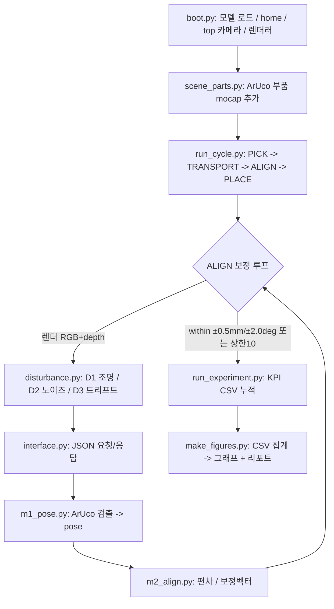
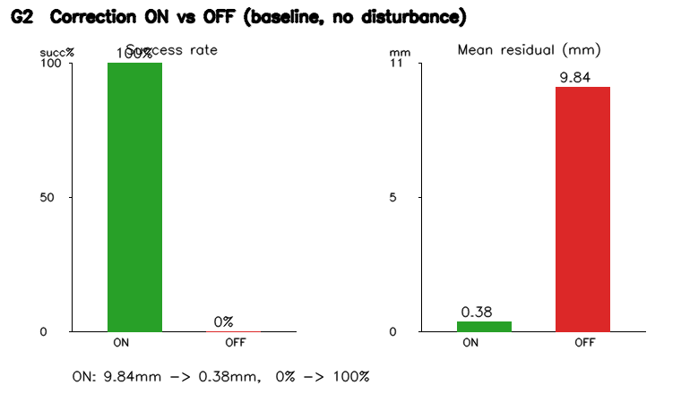
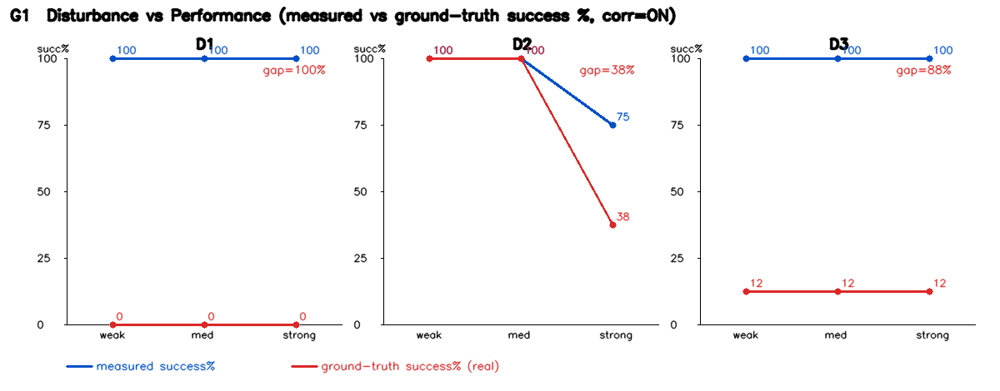
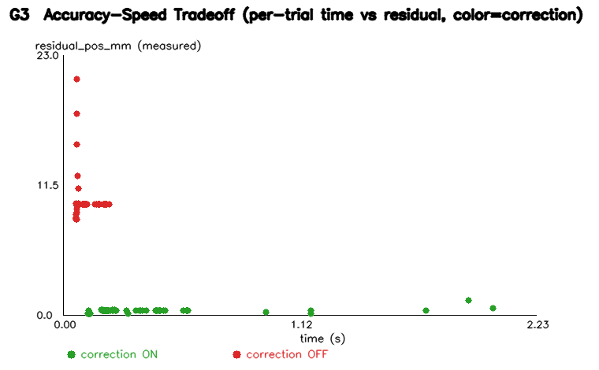

# 광학 부품 정밀 정렬 — 외란 강건성 리포트

MuJoCo + Franka Emika Panda 시뮬레이션에서 외부 비전 모듈(JSON 연동)로 광학 부품을
정밀 정렬하고, 현실 외란(조명·노이즈·좌표 드리프트)에 대한 보정 루프의 강건성을 측정했다.
모든 수치는 `experiments/results.csv`(160 trial)의 조건별 집계에서 산출했다.
SRS 허용오차: 위치 ±0.5mm / 각도 ±2.0deg, GSD 1.4475 mm/px (top 카메라 1280x960).

## 1. 프로그램 구조 (Flowchart)

파이프라인: 부팅(S1) → JSON 배관(S2) → 비전 M1/M2(S3) → 보정 폐루프(S4) → 외란 주입(S5)
→ 실험·로깅(S6) → 리포트(S7). 시뮬(/sim)과 외부 비전 모듈(/external_module)은 파일·프로세스로 분리.

## 2. 로봇 및 End-Effector

- 로봇: **Franka Emika Panda** (MuJoCo Menagerie 공식 모델, 무수정 로드). 팔 7축(actuator1~7) + 그리퍼.
- End-effector: 2지 평행 그리퍼. 액추에이터 `actuator8`(tendon 'split'), ctrlrange 0~255(0=닫힘/255=열림),
  손가락 관절 `finger_joint1/2`(열림 간격 ≈0.08m). 'home' 키프레임으로 초기 자세 유지(중력 붕괴 방지).
- 자유도 nq=9, 액추에이터 nu=8. 카메라는 씬에 없어 코드측 top-down free camera(elevation=-90)로 구성.
- 본 단계 범위에서 부품은 mocap으로 추상화(팔 home 고정)하여 정렬 보정 루프의 정확도·종료 로직에 집중.

## 3. 작업 절차

1. **집기(PICK)**: home 자세에서 그리퍼 폐합(집기 추상화).
2. **이송(TRANSPORT)**: 부품을 source→목표 근처(배치오차 포함)로 단순 웨이포인트 이동.
3. **측정·정렬(ALIGN, 폐루프)**: top 카메라 렌더(1280x960) → 외부 비전 M1 검출 → M2 편차/보정
   → 부품 보정 적용 → 재측정. **허용오차 ±0.5mm/±2.0deg 진입 또는 보정 상한 10회**에서 종료.
4. **배치(PLACE)**: 그리퍼 개방. 검출 실패 시 사이클 ABORT(크래시 없이 사유 기록).
   보정 전/후 오차를 측정·실제(ground-truth) 둘 다 기록.

## 4. 외부 비전 모듈 (이유·동작·연동 인터페이스)

- **분리 이유**: 비전(인지)을 시뮬 물리와 분리해 ① 독립 검증/교체 가능, ② 실제 카메라 모듈로의
  교체 경로 확보, ③ JSON 계약으로 sim↔perception 결합도 최소화. ROS2 없이 경량 JSON 통신.
- **동작**: 이미지 수신 → ArUco(DICT_4X4_50) 1차 검출, 실패 시 컨투어(형상 게이트) 보조,
  둘 다 실패 시 `DetectionError`. 픽셀→평면(m)은 2점 캘리브 선형매핑(GSD 1.4475 mm/px).
  M2가 `error=target-estimated`, `correction=gain·error`(부품을 목표로 이동) 산출.
- **연동 인터페이스(JSON 계약)**:
  - 요청 `{type, image(b64 PNG), depth(b64 npy), target_pose{x,y,theta}, cycle}`
  - 응답 `{estimated_pose, error{dx,dy,dtheta}, correction{dx,dy,dtheta}, within_tolerance}`
  - 단위: x,y=m / theta=rad, 기준=top 카메라 평면. 인프로세스 호출 + `handle_json(str)->str` 경계로
    소켓/서브프로세스 전환 대비.

## 5. 결과 및 한계

### 5.1 보정의 가치 (보정 ON vs OFF, baseline)
- 보정 OFF(대조군): 성공률 0%, 측정 잔류 9.84mm.
- 보정 ON(외란 없음): 성공률 100%, 측정 잔류 0.38mm.
- → 외부 비전 보정이 **9.84mm 오차를 0.38mm로 흡수**, 성공률 0%→100%. 모듈의 핵심 가치.

### 5.2 외란별 성격 (G1, 보정 ON)
- **D1 조명·반사**: weak/med/strong 측정성공 100/100/100%,
  실제성공 0.0/0.0/0.0%. 실제 잔류 strong에서 0.61mm —
  **조명도 강하면 실제 정렬이 틀어질 수 있음**(측정과 실제의 괴리 발생).
- **D2 노이즈**: 측정성공 100/100/75%,
  실제성공 100.0/100.0/37.5%. 수렴 시간 0.46→0.73→1.07s(강할수록 느려짐).
- **D3 좌표 드리프트**: 측정성공 100/100/100%,
  실제성공 12.5/12.5/12.5%. 측정상 수렴하나 실제 오차가 크게 남음(false-convergence 주범).

### 5.3 정확도-속도 트레이드오프 (G3)
- 외란이 강할수록 보정 반복(iters)·시간 증가. 보정 ON 점들은 낮은 측정 잔류에 모이고 OFF 점들은 큰 잔류에 분포.

### 5.4 한계 (Limitations)
- **False-convergence (핵심 신뢰성 리스크)**: D3 strong에서 **측정 성공률 100% vs 실제 성공률 12.5%**.
  측정 잔류는 0.30mm로 작으나 실제 잔류는 **11.62mm** — 시스템이 "정렬 완료"로 보고해도
  실제로는 크게 틀어져 있다. 비전이 자기 측정만 신뢰하면 오차를 "성공"으로 오인 → 외부 절대기준 교차검증 필요.
  (D2 strong 75%/37.5%, D1 strong 100%/0.0% 에서도 동일 괴리.)
- **D3 ground-truth 잔류오차의 이산 양자화**: 드리프트를 cycle당 고정 스텝으로 모델링해 gt 오차가 이산적으로 나타난다.
  실제 열팽창은 연속적이므로 **연속 드리프트 모델**로의 확장이 향후 과제.
- **Sim-to-Real 갭**: 핸드아이 캘리브레이션, 실제 센서 노이즈/롤링셔터, 실제 표면 반사·재질 미반영.
  부품은 mocap 추상화(물리 파지·접촉 동역학 미구현), 정렬은 검출 가능 영역(|y|≥0.4)에 한정.

### 5.5 요약 KPI (CSV 집계)
| 조건(보정 ON) | 측정 성공률 | 실제 성공률 | 측정 잔류 | 실제 잔류 |
|------|-----------|-----------|---------|---------|
| baseline(외란없음) | 100% | — | 0.38mm | — |
| D1 strong | 100% | 0.0% | 0.38mm | 0.61mm |
| D2 strong | 75% | 37.5% | 0.50mm | 0.49mm |
| D3 strong | 100% | 12.5% | 0.30mm | 11.62mm |
| baseline 보정 OFF | 0% | — | 9.84mm | — |
