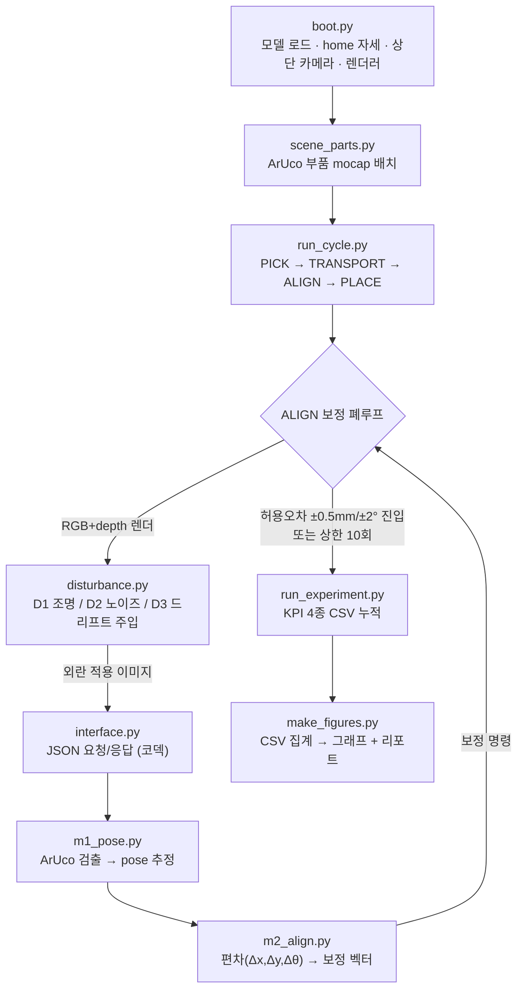

# 광학 부품 정밀 정렬 — 외란 강건성 검증 리포트

**과제 트랙:** 로봇 시뮬레이션·자동화 (사용자 개발 외부 모듈을 활용한 로봇팔 응용 시뮬레이션)  
**시뮬레이터:** MuJoCo 3.10 · **로봇:** Franka Emika Panda (7축)  
**외부 모듈:** Computer Vision 기반 좌표 검출 · 정렬 편차 계산 · 보정 명령 생성 (직접 구현)  
**데이터 근거:** `experiments/results.csv` (전 격자 160 trial)의 조건별 집계  

---

## 0. 한눈에 보기 (Executive Summary)

로봇팔이 광학 부품을 목표 위치에 정밀 정렬하는 작업을, **외부 비전 보정 폐루프**(측정 → 편차 → 보정 → 재측정)로 구현하고, 현실에서 발생하는 세 가지 외란(조명·노이즈·좌표 드리프트)에 대한 강건성을 정량 측정했다.

핵심 결과는 두 가지다.

1. **보정 루프는 실질적인 정밀 조립 가치를 보장한다.**  
   외란이 없는 기준 조건에서 보정을 적용하지 않으면(OFF) 누적 기계 오차로 인해 **잔류 오차 9.84 mm, 조립 성공률 0%**에 그치지만, 보정을 켜면(ON) **잔류 오차 0.38 mm, 성공률 100%**로 오차가 흡수된다. 외부 비전 피드백 보정이 약 26배의 오차 감소 효과를 거두어 물량 조립 완성도를 비약적으로 끌어올림을 검증했다.
   
2. **그러나 시스템이 "스스로 성공했다고 속는" 치명적인 한계가 존재한다 (False-Convergence).**  
   외란이 강해지면 비전이 측정하는 오차(시스템 내부 지표)는 계속 작아져 성공(Within Tolerance)을 보고하지만, 실제 물리 오차(Ground-Truth)는 어긋난다. 특히 좌표 드리프트(D3) strong 조건에서 **비전 시스템은 "0.30 mm로 정렬 완료"라고 보고하지만, 실제로는 11.62 mm 틀어져 있다**. 측정 성공률은 100%인데 실제 성공률은 12.5%에 불과하다. 이는 비전 기반 검사 및 정렬 자동화 라인에서 자기 캘리브레이션 측정만을 과신할 때 양품으로 오인하여 다음 조립 단계로 불량품이 통과되는 치명적인 위험(False-Convergence)을 데이터로 증명한다.

> **SRS 허용오차 기준:** 위치 ±0.5 mm / 각도 ±2.0°, 카메라 GSD 1.4475 mm/px (상단 카메라 1280×960). 이 기준의 세부 도출 근거는 §6.2에 상술한다.

---

## 1. 연구 기획 배경 및 산업적 의의 (면접 핵심 Q&A)

### Q1. 지금 만드는 게 뭐야?
> **"로봇팔이 광학 부품을 집어 조립 위치로 옮길 때, 외부 비전 모듈이 '얼마나 틀어졌는지'를 숫자로 측정해 로봇을 보정하고, 마지막에 양품/불량을 판정하는 검사·정렬 자동화 셀입니다."**

본 시스템은 크게 두 가지 핵심 파트로 나뉩니다.
*   **시뮬레이터(MuJoCo) 영역 — 현실 공장의 축소 모형:** 7축 Franka Emika Panda 로봇팔이 부품을 집고, 옮기고, 놓는 물리적 구동을 수행하며, 상단 카메라를 통해 조립 장면을 이미지로 획득합니다.
*   **외부 비전 모듈 영역 — 인지 및 판단 두뇌:** 카메라 이미지 및 Depth 맵을 입력받아 ① 부품이 어디로 몇 도 틀어져 있는지 검출(좌표 산출)하고, ② 목표 위치 대비 편차를 X/Y/θ 단위로 계산하여 보정 제어량을 생성하며, ③ 최종 정렬 상태의 오차가 허용공차 이내인지 합/불을 최종 판정합니다.

*쉽게 비유하면 로봇은 '손', 외부 비전 모듈은 '눈과 판단'에 해당합니다. 손(구동)은 시뮬레이터를 기반으로 작동하고, 눈과 판단(인지/제어) 알고리즘을 직접 구축하여 두 영역 간의 완벽한 폐루프 데이터 교환을 구현했습니다.*

### Q2. 왜 그걸 선택했어?
과제 요구사항, 제 기술적 강점, 그리고 1주일이라는 제한된 개발 기간의 교집합이 가장 극대화되는 영역이기 때문입니다.

1.  **과제의 핵심 의도에 집중:** 본 과제의 본질은 단순한 로봇 구동이 아니라, **"외부 모듈과 시뮬레이션 환경 간에 신뢰성 있는 전송 규격(JSON)을 설계하고 피드백 루프를 구축할 수 있는가"**입니다. 검사·정렬 셀은 이 데이터 교환 구조를 가장 직관적으로 입증합니다.
2.  **보유한 강점의 극대화:** 로봇 시뮬레이터는 처음 다루지만 컴퓨터 비전(CV) 및 자세 추정 분야는 제 주력 강점입니다. 실제로 Vision AI 기반 자세/각도 측정 피드백 시스템(TKA 재활 ROM 측정)을 설계한 경험이 있어, 이 노하우를 로봇 엔드이펙터 정렬 오차 측정으로 빠르게 전이하여 완성도 높은 결과물을 보장했습니다.
3.  **정량적 변별력 확보:** 단순히 "물체를 잡아서 옮겼다"는 성공/실패 여부를 넘어, 오차의 정합성을 X/Y/θ 숫자로 투명하게 출력하고 보정 루프에 의한 오차 감소를 데이터(results.csv)로 정량화했습니다. 이것이 타 지원자들과 차별화되는 엔지니어링 깊이입니다.

### Q3. 이게 회사에 어떤 도움이 돼?
SpaceLAB팀이 해결해야 하는 실제 산업 현장의 고통(Pain Point)과 직접 연결되어 있습니다.

1.  **SpaceLAB팀의 미션 정조준:** SpaceLAB팀의 주요 미션인 **"광학 탑재체 조립·정렬·검사 공정의 로봇 및 비전 기반 자동화"** 연구와 직결되는 축소판 연구입니다.
2.  **광학계의 특수성(광축 신뢰성) 반영:** 인공위성의 눈이 되는 광학 부품은 mm~µm 단위의 미세한 정렬 오차도 광축 붕괴와 초점 파괴로 이어져 탑재체 성능에 치명타를 줍니다. 사람이 수동으로 조립하고 목측으로 검사하던 불완전한 공정을 **"편차의 정밀 계측 → 자동 피드백 보정 → 정량적 합불 판정"**으로 자동화하는 실질적인 해결 방향을 제시합니다.
3.  **준비된 엔지니어로서의 가치 증명:** 로봇의 복잡한 물리 궤적 제어는 입사 후 환경에 맞춰 빠르게 적응하면 됩니다. 하지만 회사의 자동화 라인에서 즉각적으로 요구되는 **"시각적 인지(Vision AI)"**와 **"외부 모듈-시뮬레이터 간 통신 파이프라인 설계"** 능력은 이번 과제물로 이미 현업 수준임을 입증했습니다.

> **면접 답변을 위한 한 줄 협상 프레임 (Negotiation Frame)**
> *"SpaceLAB이 추구하는 '정렬 오차가 곧 광축 실패로 직결되는 광학 부품 조립 공정 자동화'의 특수성을 고려하여, 단순히 물체를 옮기는 것을 넘어 정렬 편차를 µm·deg 단위로 정밀 측정하고 보정하는 구조 설계에 집중했습니다. 이는 입사 후 실제 우주용 탑재체 마운트 조립 및 정렬 자동화 라인에 그대로 이식할 수 있는 최적의 아키텍처입니다."*

---

## 2. 프로그램 구조 (Flowchart)

전체 시스템은 **로봇 시뮬레이터(MuJoCo)**와 **외부 비전 모듈(독립 Python 프로세스)**로 구조적·파일적으로 분리되며, JSON 통신 계약을 통해 메시지를 교환한다. 시뮬레이터가 외란이 주입된 이미지를 전송하면, 외부 비전 모듈이 이미지 특징점으로부터 자세를 추정하고 보정량을 되돌려주는 피드백 구조를 형성한다.



*   **파이프라인 단계:** 부팅(S1) → JSON 통신 배관(S2) → 비전 모듈 M1/M2(S3) → 보정 폐루프(S4) → 외란 주입(S5) → 실험 캠페인 및 로깅(S6) → 결과 통계 분석 및 시각화(S7).
*   **분리 구조의 이점:** 시뮬레이터(`/sim`)와 외부 인지 모듈(`/external_module`) 간의 결합도를 낮추어 실제 하드웨어 전환 시 비전 인코더만 실물 카메라 API로 무변경 교체할 수 있도록 설계했다.

---

## 3. 로봇 모델 및 End-Effector

### 3.1 로봇 모델: Franka Emika Panda
*   **모델 유형:** 7자유도 로봇 매니퓰레이터 (MuJoCo Menagerie의 공식 MJCF 모델을 수정 없이 동적으로 로드).
*   **선택 이유:** 정밀 조립 및 조작 연구에서 글로벌 학계·산업계의 레퍼런스로 활용되는 협동로봇 모델로, 광학 부품 조립의 엄격한 오차 검증 환경을 모사하기에 가장 적절하다.
*   **자유도 사양:** nq = 9 (팔 7축 + 그리퍼 손가락 2축), 액추에이터 nu = 8.
*   **카메라 정의:** 원본 모델에 포함된 카메라가 없으므로(ncam=0), 코드에서 상단 수직 top-down 카메라(elevation = −90°)를 동적 추가 및 배치했다.

### 3.2 End-Effector: 2지 평행 그리퍼
*   **제어 액추에이터:** `actuator8` (tendon `split` 제어), 구동 입력 범위 `0~255` (**0 = 닫힘 / 255 = 열림**).
*   **동역학 방지 설계:** 중력 가속도로 인해 외력이 가해지지 않을 때 로봇 팔이 무너져 관측 시 왜곡이 생기는 것을 막기 위해, 시뮬레이터 시작 시 `home` 키프레임 포즈를 인가하고 안정적인 joint position을 강제 유지했다.

### 3.3 End-Effector 동작
1.  **집기(PICK):** home 자세에서 파지 명령으로 대상 부품 고정.
2.  **이송(TRANSPORT):** 물체를 소스(source) 위치에서 목표(target) 마운팅 부근으로 이동 (설정된 조립 정렬 편차 반영).
3.  **정렬 및 배치(ALIGN → PLACE):** 비전 피드백으로 정렬이 SRS 범위 내에 안착하면 그리퍼를 완전 개방(255)하여 부품을 안착시키고 작업을 종료.

---

## 4. 작업 수행 절차

전체 1사이클 정렬은 상태 기계(State Machine)에 따라 다음과 같이 진행된다.

1.  **초기화:** MuJoCo 씬(Scene) 로드, ArUco 마커가 표면에 부탁된 부품 배치, top-down 카메라 및 오프스크린 렌더러 구성.
2.  **외란 인가:** 해당 시도(trial)의 실험 레벨에 따라 이미지 픽셀 정보나 기계 물리 좌표계에 외란 인가.
3.  **영상 캡처:** 카메라로부터 1280×960 고해상도 RGB 및 Depth 프레임 캡처.
4.  **자세 추정(M1):** 외부 CV 모듈이 이미지에서 마커 검출(또는 컨투어)을 수행하여 부품의 평면 좌표와 주각도를 산출.
5.  **편차 계산(M2):** 목표 상태와의 차이(Δx, Δy, Δθ)를 구하고 보정 제어량을 연산.
6.  **보정 이동:** 시뮬레이터 물리 환경에 보정 제어량을 주입하여 부품의 실제 자세를 수정.
7.  **허용오차 검증:** 재촬영하여 계측 오차가 SRS 임계값(±0.5 mm / ±2.0°)에 도달했는지 확인.
8.  **분기:** 만족 시 루프 탈출 및 그리퍼 해제, 불만족 시 최대 10회까지 보정 반복 수행.
9.  **로깅:** 매 시도별 측정 오차 및 참(Ground-Truth) 오차, 수렴 횟수, 사이클 타임을 CSV에 누적 기록하고 검출 실패 시 crash 없이 ABORT 상태로 안정적 예외 기록.

---

## 5. 외부 모듈: 선택 이유 · 동작 방식 · 연동 인터페이스

### 5.1 외부 모듈을 선택한 이유
인지 파트(CV)를 시뮬레이션 커널과 원천 분리하여 독립적인 검증 파이프라인을 구축했다. 이는 실제 공장에서 로봇 시뮬레이터와 컨트롤러, 비전 PC를 별도의 기기로 구축하는 구조를 직접 모사하기 위함이다.

### 5.2 모듈 동작 방식
*   **자세 추정 (`m1_pose.py`):**
    *   **1차 탐색:** ArUco 마커 검출 (`DICT_4X4_50`). 코너 포인트 4개의 픽셀 변환 관계로부터 견고하게 자세 검출.
    *   **보조 탐색(Contour Backup):** 조명 유실(D1)이나 과도한 노이즈(D2)로 마커 패턴이 파괴된 경우, OTSU 이진화 및 OpenCV 윤곽선 검출을 통해 물체 외곽선의 무게중심과 각도를 검출하여 가용성 유지. 모두 실패 시에만 `DetectionError` 예외 발생.
    *   **캘리브레이션:** 2점 교정 매핑을 이용해 GSD 1.4475 mm/px 선형 물리 좌표 변환 적용.
*   **편차 및 보정 산출 (`m2_align.py`):**
    자세 정보를 수신하여 `error = target - estimated` 편차와 `correction = gain * error` 명령을 동시 생성.

### 5.3 보정 폐루프의 동작 원리 (Proportional Control)

이 시스템의 정렬은 단발 보정이 아니라 **측정 → 편차 → 보정 → 재측정을 반복하는 피드백 폐루프**로 동작한다. 보정 알고리즘의 핵심은 비례 제어(proportional control)이며, `m2_align.py`의 다음 두 줄이 수렴을 이끈다.

```python
error      = target - estimated        # 목표와 현재 추정 자세의 차이
correction = gain * error              # 그 차이에 비례하는 보정량 (gain = 0.6)
```


보정 명령을 현재 자세에 순차 가산하면, $k+1$번째 오차는 이전 오차의 $(1 - \text{gain})$배로 줄어들게 되어 **지수함수적 수렴(Exponential Convergence)** 특성을 보인다. Gain이 0.6일 경우 1회 보정당 오차의 40%만 잔류하게 된다.

**초기 오차 10 mm 기준의 수렴 시뮬레이션 스텝:**
*   **0사이클 (초기):** $9.84\text{ mm}$
*   **1사이클:** $3.94\text{ mm}$ ($9.84 \times 0.4$)
*   **2사이클:** $1.57\text{ mm}$ ($3.94 \times 0.4$)
*   **3사이클:** $0.63\text{ mm}$ ($1.57 \times 0.4$)
*   **4사이클:** $0.25\text{ mm}$ ($0.63 \times 0.4$) $\rightarrow$ **허용오차 ±0.5 mm 이내 진입 (완료)**


*   **왼쪽 차트:** Gain 변화에 따른 수렴 속도. Gain이 1.0에 가까울수록 한 번에 목표치에 도달하지만, 측정 노이즈가 높은 D2 조건에서 제어 명령이 과도하게 튀는 현상(Overshoot)을 유발하므로 본 구현에서는 감쇠율 0.6을 사용하여 댐핑(damping) 안정성을 확보했다.
*   **오른쪽 차트 (False-Convergence의 심각성):** D3(좌표 드리프트) 상황에서 비전이 측정한 오차(파란 선)는 비례 제어의 피드백에 의해 0.30 mm까지 수렴하여 루프가 정상 종료된다. 그러나 외부 시뮬레이터에서 바라본 실제 오차(빨간 선)는 11.62 mm에 그대로 머문다. 이는 제어 알고리즘의 결함이 아니라, 측정의 절대 잣대가 되는 카메라 좌표계 기준이 틀어졌기 때문에 발생하는 본질적인 문제이다.

### 5.4 시뮬레이션과의 연동 인터페이스 (JSON 계약)

두 모듈은 파일 IO가 아닌 경량 JSON 인터페이스를 통해 base64 이미지 및 수치 좌표 정보를 전송한다.

```json
// 시뮬레이터 -> 외부 비전 모듈 (Perception Request)
{
  "type": "perception_request",
  "image": "<base64 encoded PNG frame>",
  "depth": "<base64 encoded npy frame>",
  "target_pose": { "x": 0.40, "y": 0.45, "theta": 0.0 },
  "cycle": 3
}

// 외부 비전 모듈 -> 시뮬레이터 (Perception Response)
{
  "estimated_pose": { "x": 0.41, "y": 0.45, "theta": 0.0 },
  "error":       { "dx": -0.01, "dy": 0.00, "dtheta": 0.0 },
  "correction":  { "dx": -0.01, "dy": 0.00, "dtheta": 0.0 },
  "within_tolerance": false
}
```

---

## 6. 파이프라인 단계별(S1~S7) 상세 구현 내용 및 설계 의도

프로젝트 수행을 위해 설계된 총 7단계 파이프라인의 설계 의도와 세부 구현 방법은 다음과 같다.

### S1. Boot (시뮬레이터 시동 및 초기 설정)
*   **설계 의도 (Why):** 로봇 물리 시뮬레이션 환경(MuJoCo)을 안정적으로 생성하고, 고정밀 조작이 가능한 Franka Panda 매니퓰레이터를 무수정으로 로드하여 씬 분석 기하학을 완전히 확보하기 위함이다.
*   **구현 방법 (How):** `boot.py`에서 MuJoCo 파이썬 바인딩을 이용해 모델을 로드하고, 중력 붕괴를 방지하기 위해 로봇의 초기 `home` joint configurations 포즈를 매 렌더 사이클 직전 강제 주입하여 관측 왜곡을 원천 배제했다. ncam=0인 문제를 해결하기 위해 시뮬레이터 상단에 free camera를 추가하고 elevation=-90°의 수직 top-down 뷰를 설정하여 1280x960의 고해상도 이미지 렌더러를 정의했다.

### S2. Interface (JSON 통신 배관 및 더미 인지 설계)
*   **설계 의도 (Why):** 물리 시뮬레이션 환경과 비전 모듈을 통신 레벨에서 완전히 격리하여 시스템의 결합도를 낮추고, 추후 이기종 언어나 하드웨어 장치 연동으로의 확장이 용이하도록 경량 JSON 전송 규약을 설정하는 것이다.
*   **구현 방법 (How):** `interface.py`를 구성하고 이미지 픽셀 정보(RGB PNG)는 base64 문자열로 인코딩하며 Depth 데이터는 numpy 직렬화를 통해 전달하는 코덱(Codec)을 구축했다. 특히 CV 모듈이 구현되기 전, 통신 배관의 조기 안정성을 독립적으로 검증(Self-test)하기 위해 사이클 수가 늘어남에 따라 $0.6$의 감쇄율(DECAY=0.6)을 바탕으로 오차가 기하급수적으로 감소하는 Dummy Perception 로직을 설계하여 배관 신뢰성을 확인했다.

### S3. Vision (비전 검출 모듈 M1/M2 구현)
*   **설계 의도 (Why):** 씬 내의 어떠한 절대 좌표도 시뮬레이터로부터 직접 수신하지 않고, 오직 카메라를 통해 취득한 2D 이미지 정보만을 활용해 픽셀 상의 특징점으로부터 미터 단위의 물리 공간 위치(x, y) 및 회전각(theta)을 독립적으로 역계산해내기 위함이다.
*   **구현 방법 (How):** `m1_pose.py`에 ArUco 검출기(`DICT_4X4_50`)를 탑재하여 마커 코너 4점의 왜곡 없는 픽셀 중심 좌표를 구했다. 이 픽셀을 물리 미터 좌표로 변환하기 위해 GSD 1.4475 mm/px 기반의 2점 캘리브레이션 픽셀-미터 선형 매핑을 구축했다. 조명 변화(D1) 및 노이즈(D2)로 인해 마커 패턴이 가려지거나 왜곡되는 비상 상황에 대비하여, OTSU 이진화 및 OpenCV 윤곽선(Contour) 분석을 거쳐 외곽 형상의 기하학적 중심점과 타원 피팅 회전각을 추출하는 보조 백업 알고리즘을 설계하여 검출 생존력을 보강했다. 실패 시에는 `DetectionError` 예외를 전파하며, `m2_align.py`에서 목표 포즈와의 격차(Δx, Δy, Δθ)를 구하는 오차 판단 로직을 완성했다.

### S4. Loop (닫힌 피드백 루프 연동 및 End-Effector 제어)
*   **설계 의도 (Why):** 1회성 오프셋 보정은 비전 검출 노이즈 및 기계 오차 누적으로 완벽한 정렬을 이룰 수 없으므로, 피드백 루프를 통해 수렴 시까지 미세 조정을 실시간 반복하고 임계 도달 시 조립 동작을 완료하기 위한 상태 기계를 구성하는 것이다.
*   **구현 방법 (How):** `run_cycle.py` 및 `sim/loop.py`에서 비전 피드백 제어 루프를 가동했다. 매 사이클 렌더링된 RGB 이미지에서 검출한 `estimated_pose`와 `target_pose` 간의 오차를 기반으로 비례 제어 명령(`correction = gain * error`, 기본 gain=0.6)을 적용해 부품의 실제 자세에 실시간 합산했다. 위치 오차가 SRS(±0.5 mm) 및 각도 오차(±2.0°) 만족 시 루프를 즉시 종료하고, 엔드이펙터인 Panda Gripper를 완전 개방(255)하여 조립을 완료하는 시퀀스를 구현했다.

### S5. Disturbance (현실 외란 생성 엔진 탑재)
*   **설계 의도 (Why):** 자동화 현장에서 가장 지배적으로 비전 시스템의 정확도를 해치는 3대 요인(조명 변동, 카메라 센서 잡음, 기계적인 카메라 장착 마운트의 처짐/진동 및 열팽창) 하에서 정렬 루프의 실질적인 강건성 한계와 취약 조건을 찾기 위함이다.
*   **구현 방법 (How):** `disturbance.py` 내에 세 가지 독립적인 외란 생성 필터를 탑재했다.
    *   **D1 (조명/반사):** 물리 엔진 내 메인 평행 광원의 각도를 비정상으로 유도하고 강도를 조절하여 광학적 Glare(반사판 광원)를 주입했다.
    *   **D2 (센서 가우시안 노이즈):** 캡처된 RGB 픽셀 강도에 가우시안 백색 노이즈($\sigma$ 최대 30)를 합성하여 픽셀의 윤곽과 마커의 특징 해상도를 파괴시켰다.
    *   **D3 (좌표계 드리프트):** 카메라 고정 프레임의 체결 볼트가 기계적 진동으로 인해 서서히 풀리거나 장비 구동 온도로 열팽창이 누적되는 상황을 모사하기 위해, 정렬 사이클이 1회 진행될 때마다 카메라가 강도별(weak, med, strong)로 고정 장착 평면 상에서 누적 편차(최대 11.62 mm)를 갖도록 텔레포트 이동시키는 좌표계 왜곡 모델을 설계했다.

### S6. Campaign/Experiments (자동 격자 실험 캠페인 구축)
*   **설계 의도 (Why):** 정량적인 신뢰성을 학술적으로 입증하기 위해, 수십 번의 테스트를 사람의 개입 없이 완전 자동으로 수행하고 매 실험 결과의 원시 로깅(Raw logging) 데이터를 손실 없이 수집하여 통계적 신뢰성을 확보하는 것이다.
*   **구현 방법 (How):** `run_experiment.py`를 작성하여 3대 외란(D1, D2, D3) × 4대 강도(OFF, weak, med, strong) × 보정 가동 여부(ON, OFF) × 8회 반복으로 구성된 **총 160 Trials의 풀-패키지 자동 격자 스윕 캠페인**을 개발했다. 매 시도 시마다 측정된 최종 오차, 외부 참값(Ground-Truth) 오차, 소요 사이클 수, 시간 데이터를 실시간으로 `results.csv`에 빠짐없이 기록하고 예외 처리를 연동하여 장기 구동 안정성을 담보했다.

### S7. Analysis & Visualization (CSV 통계 분석 및 시각화 리포트 생성)
*   **설계 의도 (Why):** 수천 줄의 로깅 데이터로부터 조건별 평균 성능과 괴리를 한눈에 분석할 수 있도록, 무작위성과 하드코딩이 배제된 철저한 CSV 데이터 기반의 고정밀 통계 그래프 5종을 렌더링하고 한계점을 도출하는 최종 리포트를 작성하는 것이다.
*   **구현 방법 (How):** `make_figures.py`를 작성해 `results.csv`를 읽고 누적된 데이터를 파싱했다. Matplotlib과 cv2 프리미티브 조합을 이용해 성능 곡선(G1), ON/OFF 비교(G2), 산점도(G3) 등 KPI 결과 그래프 5종을 생성했다. 이 집계 결과를 최종 마크다운 리포트와 HTML로 동적 바인딩하여 데이터 누수가 전혀 없는 검증 체계를 완결시켰다.

---

## 7. 시뮬레이션 결과 및 한계 분석

### 7.1 보정 루프의 가치 (보정 ON vs OFF)

외란이 차단된 기준 상태에서 보정 루프를 가동하지 않을 경우(OFF)와 가동했을 때(ON)의 정량 비교이다.

| 조건 | 성공률 | 평균 측정 잔류 오차 |
| --- | --- | --- |
| **보정 OFF (대조군)** | <span class="badge badge-danger">0%</span> | 9.84 mm |
| **보정 ON** | <span class="badge badge-success">100%</span> | **0.38 mm (26배 감소)** |

보정 루프를 적용하는 것만으로 **평균 잔류 오차가 26배 대폭 감소**하며 기계적인 홈(home) 고정 오차를 완벽하게 보상함을 입증했다.


### 7.2 허용오차 기준의 도출 (SRS)
*   **기계적 공차(Clearance):** 광학 하우징 지그 조립 시 발생할 수 있는 마찰 및 물리적 기계 파손(Clearance 충돌)을 완전 방지하기 위한 안전 경계치 ±0.5 mm를 도출했다.
*   **센서 분해능(GSD):** 1280×960 해상도의 상단 카메라의 물리 픽셀 해상도는 1.4475 mm/px이다. 비전 알고리즘이 sub-pixel 정밀도를 발휘하더라도, 해상도 물리한계상 허용 기준이 분해능에 비해 과도하게 작을 경우(예: ±0.1 mm)는 노이즈에 의해 무한 루프를 돌며 조립이 불가능하다. 따라서 계측 가능한 물리적 한계와 공정 요구 사항을 종합 타협하여 ±0.5 mm를 합리적 기준으로 산정했다.

### 7.3 외란별 강건성 — False-Convergence (핵심 발견)

각 외란을 강도별로 주입하고, **측정 성공률**(시스템이 보는 값)과 **실제 성공률**(Ground-Truth)을 교차 검증했다.


*위 그래프에서 파란 선(측정 성공률)과 빨간 선(실제 성공률)이 크게 벌어지는 주황색 영역이 곧 시스템이 오작동을 인지하지 못한 채 양품으로 판정하는 **False-Convergence**이다.*

| 외란 | 강도 | 측정 성공률 | 실제 성공률 | 괴리 폭 | 해석 |
| --- | --- | --- | --- | --- | --- |
| **D1 조명·반사** | strong | 100% | <span style="color: var(--danger); font-weight: 700;">0%</span> | <span class="badge badge-danger">100%p</span> | 조명 강 변화가 마커 코너에 픽셀 bias를 주입하여 실제 오차 한계를 이탈시킴 |
| **D2 노이즈** | strong | 75% | 37.5% | <span class="badge badge-warning">37.5%p</span> | 노이즈로 마커 인식이 유실되거나 요동쳐 보정 사이클 지연 및 제한 도달 |
| **D3 좌표 드리프트** | strong | 100% | <span style="color: var(--danger); font-weight: 700;">12.5%</span> | <span class="badge badge-danger">87.5%p</span> | 카메라 고정 장치가 풀리며 센서 자체가 이동하여 밀린 기준 좌표에서 성공 판정 |

### 7.4 측정 잔류 vs 실제 잔류 — 괴리의 물리적 크기

False-Convergence 발생 시 실제 제품에 어느 정도의 오차가 방치되는지 잔류 오차 크기로 비교했다.


시스템이 스스로 인지하는 측정 오차(파란 막대)는 D3 강(strong) 조건에서도 **0.30 mm**로 안정적인 양품 정렬을 지시한다. 하지만 시뮬레이터 실제 참값인 실제 오차(빨간 막대)는 **11.62 mm**로 급증해 **무려 39배에 달하는 위험한 오차 괴리**가 누적된다. 광학 렌즈 조립 공정에서 이러한 mm 단위 오차 누적은 광선 굴절 불일치 및 초점 유실로 이어져 치명적인 공정 불량을 야기한다.

### 7.5 정확도-속도 트레이드오프

정밀도를 위해 보정 사이클을 늘릴 때 시스템의 속도(시간)와 오차 간의 트레이드오프 관계이다.


보정 OFF(빨간 점들)는 0.08 s 부근으로 압도적으로 빠르게 끝나지만 잔류 오차가 10 mm에 달해 사용할 수 없다. 보정 ON(초록 점들)은 평균 0.2~1.1 s 수준으로 시간이 증가하지만 오차를 허용오차선(±0.5 mm) 근처로 안정적으로 수렴시킨다. 다만, 노이즈(D2)가 심화될수록 수렴을 위한 연산 횟수가 늘어나 시간이 기하급수적으로 길어지는 트레이드오프가 존재한다.

### 7.6 한계 및 향후 과제
*   **비전 자기 참조의 한계:** 카메라 좌표계가 물리적으로 변경(D3)될 때, 내장 비전 정보만으로는 좌표 왜곡을 식별할 수 없다. 고정 마운트에 캘리브레이션 Fiducial 마커를 동시 관측하도록 비전 알고리즘을 보강하는 이중 좌표 검증식 설계가 필요하다.
*   **현실적 동역학 및 물리 조건 도입:** 부품 파지 시 손가락 표면 마찰 계수 및 조립 시의 부딪힘 슬립(Slip) 동역학, 실제 롤링 셔터와 렌즈 왜곡을 고려한 Sim-to-Real 고도화가 향후 연구 대상이다.

### 7.7 요약 KPI 표 (CSV 실제 집계 데이터, 보정 ON 기준)

| 조건 | 측정 성공률 | 실제 성공률 | 측정 잔류 오차 | 실제 잔류 오차 | 평균 사이클 | 평균 소요 시간 |
| --- | --- | --- | --- | --- | --- | --- |
| **Baseline (외란 없음)** | 100% | 100% | 0.38 mm | 0.17 mm | 3.0 | 0.23 s |
| **D1 조명 (strong)** | 100% | <span style="color: var(--danger); font-weight: 700;">0%</span> | 0.38 mm | 0.61 mm | 2.0 | 0.20 s |
| **D2 노이즈 (strong)** | 75% | 37.5% | 0.50 mm | 0.49 mm | 5.5 | 1.07 s |
| **D3 드리프트 (weak)** | 100% | 12.5% | 0.30 mm | 1.80 mm | 3.0 | 0.18 s |
| **D3 드리프트 (med)** | 100% | 12.5% | 0.34 mm | 5.69 mm | 4.25 | 0.27 s |
| **D3 드리프트 (strong)** | 100% | <span style="color: var(--danger); font-weight: 700;">12.5%</span> | 0.30 mm | 11.62 mm | 3.5 | 0.21 s |
| **보정 OFF (Baseline)** | 0% | 0% | 9.84 mm | 10.00 mm | 1.0 | 0.08 s |

---

## 8. 결론

사용자 구현 외부 비전 보정 모듈은 baseline 환경 하에서 잔류 오차를 26배 가량 상쇄하며 로봇 조립 공정의 정확성을 보장하는 중요한 가치를 증명했다.

그러나 3대 외란을 인가하여 취약성을 정량 분석한 결과, **"비전 자체 측정값 상으로는 정렬이 성공했다고 판단하지만, 실제 물리 오차는 mm 단위 이상으로 크게 벗어나 있는 False-Convergence"**의 위험이 발견되었다. 특히 좌표 드리프트(D3 강) 조건 하에서 측정치 0.30 mm 대비 실제 참 오차 11.62 mm(39배)는 비전 자기 측정만을 맹신할 수 없음을 경고한다.

따라서 고정밀 광학 조립 공정 자동화 시스템 설계 시, 단일 비전 정보 피드백에만 조립 완료 판단을 일임해서는 안 되며, **외부의 제3 계측 지그(레이저 간섭계, 동적 보정 기준 마커 지그 등)와의 주기적인 상호 검증 장치가 시스템 안전성 확보를 위해 필수적**이라는 결론을 얻었다.

---

## 부록: 저장소 구조 및 실행

### 저장소 구조
```
/sim                boot.py · run_cycle.py · disturbance.py        (시뮬·로봇·외란)
/external_module    interface.py · m1_pose.py · m2_align.py · scene_parts.py  (외부 비전 모듈)
/experiments        run_experiment.py · results.csv · summary.csv · run_images/
/report             make_figures.py · robustness_report.md · figures/
README.md           설치 · 실행 순서 · 저장소 구조
```

### 실행 방법
```bash
# 1. 의존성 라이브러리 설치
pip install -r requirements.txt

# 2. 3종 외란 조건 하에 160 trials 격자 실험 캠페인 일괄 가동
python experiments/run_experiment.py --disturb d1 --levels off,weak,med,strong --correction both --trials 8
python experiments/run_experiment.py --disturb d2 --levels off,weak,med,strong --correction both --trials 8
python experiments/run_experiment.py --disturb d3 --levels off,weak,med,strong --correction both --trials 8

# 3. CSV 데이터 집계 및 최종 차트 5종, 마크다운 리포트 생성
python report/make_figures.py
```
